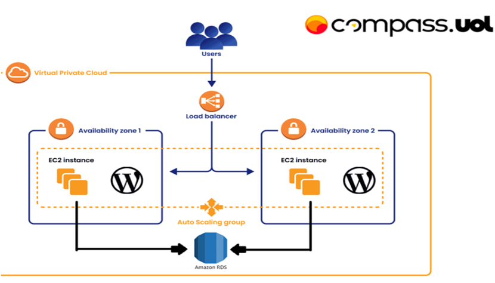
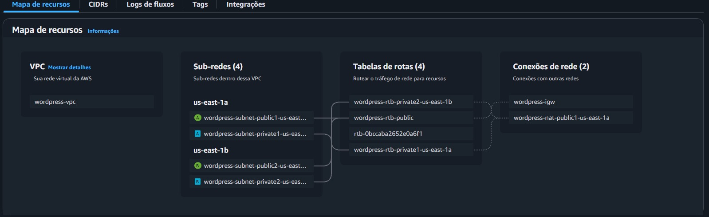
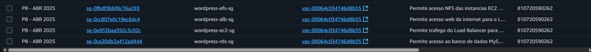
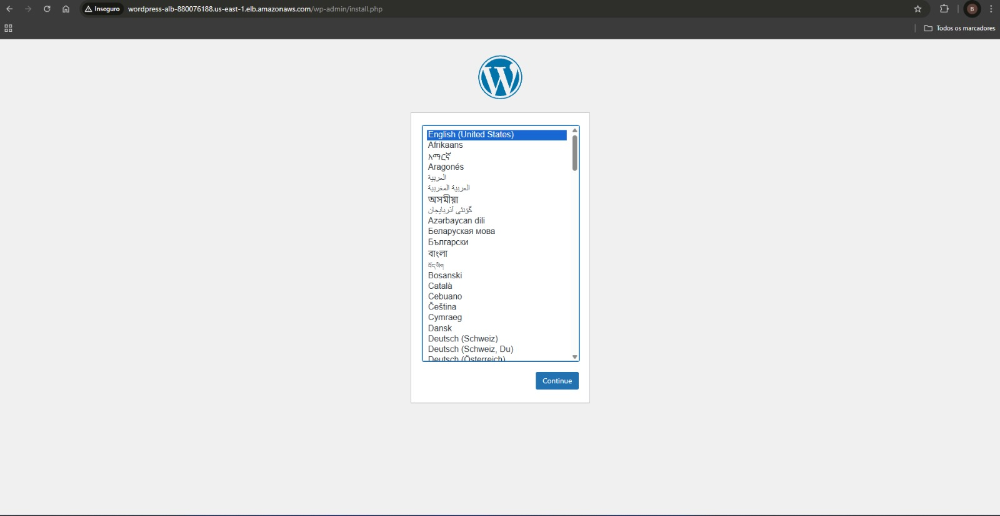

# Implantação de WordPress na AWS: Arquitetura Escalável e de Alta Disponibilidade

   

 

> Este projeto detalha a implementação de uma infraestrutura completa para **WordPress na AWS**

---

### 🗺️ Tabela de Conteúdos
1.  [Objetivo do Projeto](#-objetivo-do-projeto)
2.  [Arquitetura Final da Solução](#️-arquitetura-final-da-solução)
3.  [Serviços AWS Utilizados](#️-serviços-aws-utilizados)
4.  [Detalhes da Infraestrutura](#️-detalhes-da-infraestrutura)
5.  [Resultado Final](#-resultado-final)

---

## 🎯 Objetivo do Projeto

O objetivo central foi projetar e implantar uma solução de nível profissional para WordPress, conforme a topologia e os requisitos especificados, consolidando conhecimentos em:
- **Segurança:** Isolar recursos em redes privadas e aplicar o princípio do menor privilégio.
- **Alta Disponibilidade:** Garantir que a aplicação se mantenha operacional mesmo com falhas em componentes individuais.
- **Escalabilidade:** Permitir que a infraestrutura se ajuste dinamicamente às variações de tráfego.
- **Automação (IaC):** Provisionar e configurar o ambiente de forma automática e reprodutível.

 

## 🏗️ Arquitetura Final da Solução

A arquitetura foi cuidadosamente planejada para desacoplar as camadas da aplicação, utilizando serviços gerenciados da AWS para maximizar a eficiência operacional e a segurança.

  
  
<em>Diagrama da arquitetura de alta disponibilidade para WordPress.</em>

---

## 🛠️ Serviços AWS Utilizados

A tabela abaixo resume os principais serviços AWS e suas finalidades no projeto.

| Serviço | Finalidade no Projeto |
| :--- | :--- |
| **Amazon VPC** | Criação de uma rede virtual isolada para hospedar todos os recursos. |
| **Amazon EC2** | Servidores virtuais que executam a aplicação WordPress em containers Docker. |
| **Auto Scaling Group** | Automatiza a criação, recuperação e escalabilidade da frota de instâncias. |
| **Application Load Balancer** | Ponto de entrada que distribui o tráfego HTTP de forma balanceada e segura. |
| **Amazon RDS** | Fornece um banco de dados MySQL gerenciado (Single-AZ, conforme requisito do ambiente). |
| **Amazon EFS** | Oferece um sistema de arquivos de rede compartilhado e persistente para a pasta `wp-content`. |
| **AWS IAM** | Gerencia permissões de forma granular e segura para a interação entre os recursos. |

---

## ⚙️ Detalhes da Infraestrutura

*A seguir, uma visão detalhada da configuração de cada componente fundamental da arquitetura.*

### 🏛️ **Rede (VPC)**
Foi provisionada uma VPC customizada (`wordpress-final-vpc`) com sub-redes públicas e privadas em duas Zonas de Disponibilidade. Um NAT Gateway foi configurado para permitir que os recursos nas sub-redes privadas acessem a internet para atualizações de software.

  
  
<em>Mapa de Recursos da VPC, mostrando sub-redes, tabelas de rotas e gateways.</em>

### 🛡️ **Segurança (Security Groups)**
Uma estratégia de "defesa em profundidade" foi aplicada com Security Groups específicos para cada camada, liberando apenas o tráfego essencial nas portas e protocolos corretos.

  
  
<em>Regras de firewall para o Load Balancer, EC2, EFS e RDS.</em>

### 👤 **Identidade (IAM)**
Uma IAM Role (`wordpress-ec2-role`) foi criada e associada às instâncias EC2, concedendo as permissões necessárias para interagir com outros serviços AWS de forma segura.

  
  
<em>Role criada para permitir que as instâncias EC2 acessem outros serviços.</em>

### 💻 **Aplicação (EC2 e Auto Scaling)**
O Auto Scaling Group gerencia instâncias EC2 (`t2.micro`) baseadas em um Launch Template. Essas instâncias rodam a aplicação WordPress em um container Docker e são lançadas em sub-redes privadas para maior segurança, garantindo também a auto-recuperação e escalabilidade.

---

### 🌐 **Balanceamento de Carga (Application Load Balancer)**
O ALB serve como o ponto de entrada único e público para o site. Ele é posicionado nas sub-redes públicas e distribui o tráfego de forma segura para as instâncias EC2 saudáveis nas sub-redes privadas.

---

### 🗃️ **Banco de Dados (RDS)**
Um banco de dados MySQL gerenciado pelo RDS foi provisionado em uma configuração Single-AZ, conforme os requisitos do projeto. Ele fica em sub-redes privadas, e seu acesso é restrito apenas às instâncias EC2 através de Security Groups.

---

### 🗂️ **Armazenamento de Arquivos (EFS)**
O serviço EFS foi utilizado para criar um sistema de arquivos de rede compartilhado. A pasta `wp-content` do WordPress é montada neste EFS, garantindo que todos os uploads, temas e plugins sejam consistentes entre todas as instâncias EC2.

---

## ✅ Resultado Final

Após a conclusão de todos os passos, a arquitetura está totalmente operacional. O acesso ao site é feito através do **Nome DNS do Application Load Balancer**. O resultado é a tela de instalação padrão do WordPress, confirmando que todos os componentes estão se comunicando corretamente e que o projeto foi um sucesso.

  
  
<em>Tela de instalação do WordPress, acessada via DNS do Load Balancer.</em>

